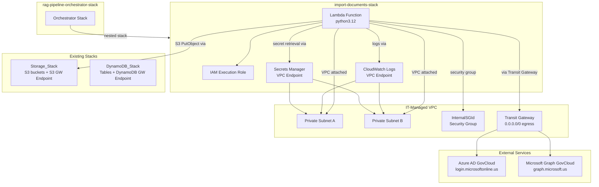
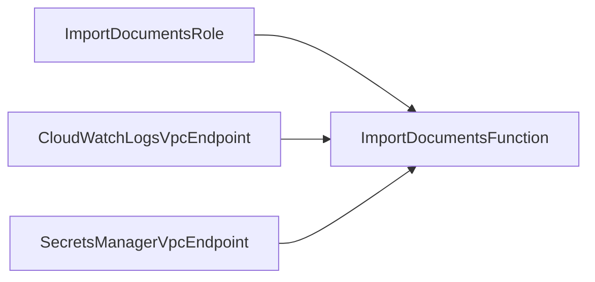

# Design Document: CloudFormation Stack for ImportDocuments Lambda

## Overview

This design specifies the CloudFormation template (`import-documents-stack.json`) that deploys the Python ImportDocuments Lambda function as a nested stack within the RAG pipeline orchestrator. The template follows the exact patterns established by existing nested stacks and targets AWS GovCloud (`us-gov-west-1`).

The stack creates five resources:
1. An IAM execution role with least-privilege policies
2. A Lambda function (Python 3.12) deployed into VPC private subnets
3. A CloudWatch Logs VPC interface endpoint
4. A Secrets Manager VPC interface endpoint
5. (Implicitly) A CloudWatch log group created by the Lambda service

The template is a pure CloudFormation JSON file — no SAM transforms, no custom resources, no CDK. It integrates with the orchestrator via parameters and with the Storage_Stack via `Fn::ImportValue` cross-stack references.

### Key Design Decisions

1. **JSON format, not YAML**: All existing stacks use JSON. Consistency wins.
2. **`InternalSGId` parameter name**: The orchestrator passes `InternalSGId` (not `InternalSecurityGroupId`). Some nested stacks (OpenSearch, RDS) use `InternalSecurityGroupId` internally and the orchestrator maps to it. This stack uses `InternalSGId` directly to match the orchestrator parameter name, avoiding an unnecessary mapping layer.
3. **No S3 or DynamoDB endpoints**: Storage_Stack creates the S3 gateway endpoint; DynamoDB_Stack creates the DynamoDB gateway endpoint. This stack does not duplicate them.
4. **Runtime secret retrieval**: The Lambda receives `clientSecretArn` as an environment variable and calls `secretsmanager:GetSecretValue` at runtime. The actual secret value never appears in CloudFormation parameters, outputs, or the Lambda console.
5. **Interface endpoints use the IT-managed security group**: The InternalSGId security group has a self-referencing inbound rule and `0.0.0.0/0` outbound, which satisfies the HTTPS (443) traffic requirements for VPC interface endpoints.
6. **`DependsOn` for Lambda → Endpoints**: The Lambda function declares `DependsOn` on both VPC endpoints so that CloudWatch logging and Secrets Manager access work from the first invocation.

## Architecture



### Network Flow Summary

| Traffic | Path | Endpoint Type |
|---|---|---|
| CloudWatch Logs | Lambda → CW Logs VPC Endpoint (AWS backbone) | Interface (this stack) |
| Secrets Manager | Lambda → SM VPC Endpoint (AWS backbone) | Interface (this stack) |
| S3 PutObject | Lambda → S3 Gateway Endpoint (AWS backbone) | Gateway (Storage_Stack) |
| Azure AD auth | Lambda → Transit Gateway → Internet → `login.microsoftonline.us` | Transit Gateway |
| Graph API calls | Lambda → Transit Gateway → Internet → `graph.microsoft.us` | Transit Gateway |

## Components and Interfaces

### Template Parameters

The template defines 13 parameters, matching the orchestrator's parameter-passing pattern:

| Parameter | Type | Description | Default |
|---|---|---|---|
| `ProjectPrefix` | String | Resource naming prefix (max 30, `^[a-z0-9][a-z0-9\-]*[a-z0-9]$`) | — |
| `EnvironmentTag` | String | Environment tag value (e.g., Production) | — |
| `VpcId` | AWS::EC2::VPC::Id | VPC for endpoints | — |
| `PrivateSubnetAId` | AWS::EC2::Subnet::Id | Subnet A for Lambda + endpoints | — |
| `PrivateSubnetBId` | AWS::EC2::Subnet::Id | Subnet B for Lambda + endpoints | — |
| `InternalSGId` | AWS::EC2::SecurityGroup::Id | IT-managed security group | — |
| `PrivateRouteTableId` | String | Route table ID (accepted for consistency; not used by this stack's resources) | — |
| `StorageStackName` | String | Storage_Stack name for cross-stack imports | — |
| `LambdaS3Key` | String | S3 key of Lambda zip in Pipeline_Artifacts_Bucket | — |
| `TenantId` | String | Azure AD tenant ID | — |
| `ClientId` | String | Azure AD client ID | — |
| `ClientSecretArn` | String | ARN of Secrets Manager secret | — |
| `SharepointUrl` | String | SharePoint site URL | — |
| `DriveName` | String | SharePoint drive name | — |
| `CsvCategories` | String | Comma-separated category filter | `""` |
| `SharePointFolderPath` | String | SharePoint folder path filter | `""` |

Note: `PrivateRouteTableId` is accepted as a parameter for orchestrator consistency (all nested stacks accept it), but this stack's resources (interface endpoints) don't use route tables — only gateway endpoints do.

### Resource Definitions

#### 1. IAM Execution Role (`ImportDocumentsRole`)

- **Type**: `AWS::IAM::Role`
- **Name**: `${ProjectPrefix}-import-documents-role`
- **Trust Policy**: `lambda.amazonaws.com` only
- **Inline Policies**:

**S3 Access Policy** — scoped to Raw_Documents_Bucket:
```json
{
  "Effect": "Allow",
  "Action": ["s3:PutObject", "s3:PutObjectTagging"],
  "Resource": {
    "Fn::Sub": [
      "arn:${AWS::Partition}:s3:::${BucketName}/*",
      { "BucketName": { "Fn::ImportValue": { "Fn::Sub": "${StorageStackName}-RawDocumentsBucketName" } } }
    ]
  }
}
```

**CloudWatch Logs Policy** — scoped to the Lambda's log group:
```json
{
  "Effect": "Allow",
  "Action": ["logs:CreateLogGroup", "logs:CreateLogStream", "logs:PutLogEvents"],
  "Resource": {
    "Fn::Sub": "arn:${AWS::Partition}:logs:${AWS::Region}:${AWS::AccountId}:log-group:/aws/lambda/${ProjectPrefix}-import-documents:*"
  }
}
```

**VPC Network Interface Policy** — scoped to region/account:
```json
{
  "Effect": "Allow",
  "Action": ["ec2:CreateNetworkInterface", "ec2:DescribeNetworkInterfaces", "ec2:DeleteNetworkInterface"],
  "Resource": "*"
}
```
Note: EC2 network interface actions cannot be scoped to specific resources — `Resource: "*"` is the standard pattern for VPC-attached Lambdas. This matches AWS documentation and the managed policy `AWSLambdaVPCAccessExecutionRole`.

**Secrets Manager Policy** — scoped to the specific secret:
```json
{
  "Effect": "Allow",
  "Action": "secretsmanager:GetSecretValue",
  "Resource": { "Ref": "ClientSecretArn" }
}
```

#### 2. Lambda Function (`ImportDocumentsFunction`)

- **Type**: `AWS::Lambda::Function`
- **Name**: `${ProjectPrefix}-import-documents`
- **Runtime**: `python3.12`
- **Handler**: `import_documents.handler`
- **Timeout**: 120
- **MemorySize**: 512
- **Architectures**: `["x86_64"]`
- **Role**: `Fn::GetAtt: [ImportDocumentsRole, Arn]`
- **DependsOn**: `[CloudWatchLogsVpcEndpoint, SecretsManagerVpcEndpoint]`
- **Code**:
  ```json
  {
    "S3Bucket": { "Fn::ImportValue": { "Fn::Sub": "${StorageStackName}-PipelineArtifactsBucketName" } },
    "S3Key": { "Ref": "LambdaS3Key" }
  }
  ```
- **VpcConfig**:
  ```json
  {
    "SubnetIds": [{ "Ref": "PrivateSubnetAId" }, { "Ref": "PrivateSubnetBId" }],
    "SecurityGroupIds": [{ "Ref": "InternalSGId" }]
  }
  ```
- **Environment Variables**:
  | Env Var | Source |
  |---|---|
  | `clientId` | `Ref: ClientId` |
  | `clientSecretArn` | `Ref: ClientSecretArn` |
  | `tenantId` | `Ref: TenantId` |
  | `sharepointUrl` | `Ref: SharepointUrl` |
  | `driveName` | `Ref: DriveName` |
  | `outputBucket` | `Fn::ImportValue: ${StorageStackName}-RawDocumentsBucketName` |
  | `csvCategories` | `Ref: CsvCategories` |
  | `sharePointFolderPath` | `Ref: SharePointFolderPath` |

- **Tags**: `Environment: {EnvironmentTag}`, `Project: RAGPipeline`

**Important**: The Lambda code reads `clientSecretArn` (not `clientSecret`). The `sharepoint_auth.py` module currently reads `clientSecret` from the environment. The Lambda handler or auth module must be updated to retrieve the secret from Secrets Manager using the ARN. This is a code change tracked separately from the CloudFormation template.

#### 3. CloudWatch Logs VPC Endpoint (`CloudWatchLogsVpcEndpoint`)

- **Type**: `AWS::EC2::VPCEndpoint`
- **VpcEndpointType**: `Interface`
- **ServiceName**: `Fn::Sub: com.amazonaws.${AWS::Region}.logs`
- **VpcId**: `Ref: VpcId`
- **SubnetIds**: `[PrivateSubnetAId, PrivateSubnetBId]`
- **SecurityGroupIds**: `[InternalSGId]`
- **PrivateDnsEnabled**: `true`
- **Tags**: `Environment: {EnvironmentTag}`, `Project: RAGPipeline`

#### 4. Secrets Manager VPC Endpoint (`SecretsManagerVpcEndpoint`)

- **Type**: `AWS::EC2::VPCEndpoint`
- **VpcEndpointType**: `Interface`
- **ServiceName**: `Fn::Sub: com.amazonaws.${AWS::Region}.secretsmanager`
- **VpcId**: `Ref: VpcId`
- **SubnetIds**: `[PrivateSubnetAId, PrivateSubnetBId]`
- **SecurityGroupIds**: `[InternalSGId]`
- **PrivateDnsEnabled**: `true`
- **Tags**: `Environment: {EnvironmentTag}`, `Project: RAGPipeline`

### Stack Outputs

| Output | Value | Export Name |
|---|---|---|
| ImportDocumentsFunctionArn | Lambda ARN | `${AWS::StackName}-ImportDocumentsFunctionArn` |
| ImportDocumentsFunctionName | Lambda name | `${AWS::StackName}-ImportDocumentsFunctionName` |
| ImportDocumentsRoleArn | Role ARN | `${AWS::StackName}-ImportDocumentsRoleArn` |
| CloudWatchLogsVpcEndpointId | Endpoint ID | `${AWS::StackName}-CloudWatchLogsVpcEndpointId` |
| SecretsManagerVpcEndpointId | Endpoint ID | `${AWS::StackName}-SecretsManagerVpcEndpointId` |

### Cross-Stack Import Pattern

This stack imports three values from Storage_Stack:

```
Fn::ImportValue: { Fn::Sub: "${StorageStackName}-PipelineArtifactsBucketName" }  → Lambda Code S3Bucket
Fn::ImportValue: { Fn::Sub: "${StorageStackName}-RawDocumentsBucketName" }       → outputBucket env var
Fn::ImportValue: { Fn::Sub: "${StorageStackName}-RawDocumentsBucketArn" }        → IAM S3 policy Resource
```

This matches the pattern used by other stacks that reference Storage_Stack exports.

### Orchestrator Integration

The orchestrator (`rag-pipeline-orchestrator-stack.json`) will add a new `ImportDocumentsStack` resource:

```json
{
  "ImportDocumentsStack": {
    "Type": "AWS::CloudFormation::Stack",
    "DependsOn": "StorageStack",
    "Properties": {
      "TemplateURL": "import-documents-stack.json",
      "Parameters": {
        "ProjectPrefix": { "Ref": "ProjectPrefix" },
        "EnvironmentTag": { "Ref": "EnvironmentTag" },
        "VpcId": { "Ref": "VpcId" },
        "PrivateSubnetAId": { "Ref": "PrivateSubnetAId" },
        "PrivateSubnetBId": { "Ref": "PrivateSubnetBId" },
        "InternalSGId": { "Ref": "InternalSGId" },
        "PrivateRouteTableId": { "Ref": "PrivateRouteTableId" },
        "StorageStackName": { "Fn::Select": [1, { "Fn::Split": ["/", { "Ref": "StorageStack" }] }] },
        "LambdaS3Key": { "Ref": "ImportDocumentsLambdaS3Key" },
        "TenantId": { "Ref": "TenantId" },
        "ClientId": { "Ref": "ClientId" },
        "ClientSecretArn": { "Ref": "ClientSecretArn" },
        "SharepointUrl": { "Ref": "SharepointUrl" },
        "DriveName": { "Ref": "DriveName" },
        "CsvCategories": { "Ref": "CsvCategories" },
        "SharePointFolderPath": { "Ref": "SharePointFolderPath" }
      }
    }
  }
}
```

The orchestrator must also add corresponding parameters for the new ImportDocuments-specific values (`TenantId`, `ClientId`, `ClientSecretArn`, `SharepointUrl`, `DriveName`, `ImportDocumentsLambdaS3Key`, `CsvCategories`, `SharePointFolderPath`).

`DependsOn: StorageStack` ensures the Storage_Stack exports exist before this stack tries to import them.

## Data Models

### CloudFormation Template Structure

The template follows the standard CloudFormation JSON structure:

```
import-documents-stack.json
├── AWSTemplateFormatVersion: "2010-09-09"
├── Description: (includes S3 Gateway Endpoint dependency note per Req 8.3)
├── Parameters (16 parameters)
│   ├── ProjectPrefix
│   ├── EnvironmentTag
│   ├── VpcId
│   ├── PrivateSubnetAId
│   ├── PrivateSubnetBId
│   ├── InternalSGId
│   ├── PrivateRouteTableId
│   ├── StorageStackName
│   ├── LambdaS3Key
│   ├── TenantId
│   ├── ClientId
│   ├── ClientSecretArn
│   ├── SharepointUrl
│   ├── DriveName
│   ├── CsvCategories (default: "")
│   └── SharePointFolderPath (default: "")
├── Resources (4 resources)
│   ├── ImportDocumentsRole (AWS::IAM::Role)
│   ├── ImportDocumentsFunction (AWS::Lambda::Function)
│   ├── CloudWatchLogsVpcEndpoint (AWS::EC2::VPCEndpoint)
│   └── SecretsManagerVpcEndpoint (AWS::EC2::VPCEndpoint)
└── Outputs (5 exports)
    ├── ImportDocumentsFunctionArn
    ├── ImportDocumentsFunctionName
    ├── ImportDocumentsRoleArn
    ├── CloudWatchLogsVpcEndpointId
    └── SecretsManagerVpcEndpointId
```

### Resource Dependency Graph



The Lambda depends on the role (via `Fn::GetAtt` for the ARN) and on both VPC endpoints (via explicit `DependsOn`). The VPC endpoints and role have no dependencies on each other and can be created in parallel.

### ARN Construction Patterns

All ARNs use `${AWS::Partition}` for GovCloud compatibility:

| Resource | ARN Pattern |
|---|---|
| CloudWatch Log Group | `arn:${AWS::Partition}:logs:${AWS::Region}:${AWS::AccountId}:log-group:/aws/lambda/${ProjectPrefix}-import-documents:*` |
| S3 Bucket Objects | `arn:${AWS::Partition}:s3:::${BucketName}/*` |
| Secrets Manager Secret | Passed as `ClientSecretArn` parameter (already a full ARN) |
| EC2 Network Interfaces | `*` (cannot be scoped) |


## Correctness Properties

Property-based testing (PBT) does not apply to this feature. The deliverable is a static CloudFormation JSON template — a declarative infrastructure configuration, not a function with inputs and outputs. There is no input space to generate random values over, and no function to invoke repeatedly. Running 100 iterations of the same structural check on the same fixed JSON file provides no additional value over a single check.

Instead, correctness is validated through:
1. **Structural validation tests** — parse the template JSON and assert specific properties (parameter definitions, resource configurations, tag presence, ARN patterns)
2. **cfn-lint** — CloudFormation linting for syntax, schema, and resource property validation
3. **cfn-guard** — compliance checking against security rules
4. **Cross-template consistency checks** — verify the template's parameters match what the orchestrator passes

These are all example-based tests with concrete assertions against the fixed template document.

## Error Handling

### Template Validation Errors

| Error Scenario | Detection | Mitigation |
|---|---|---|
| Invalid ProjectPrefix (uppercase, special chars) | `AllowedPattern` constraint on parameter | CloudFormation rejects the stack creation with a validation error |
| Missing required parameter | No `Default` value defined | CloudFormation rejects the stack creation |
| Storage_Stack not deployed | `Fn::ImportValue` fails | CloudFormation returns "Export not found" error. `DependsOn: StorageStack` in orchestrator prevents this |
| Invalid ClientSecretArn | Malformed ARN string | Lambda fails at runtime when calling `secretsmanager:GetSecretValue`. Template cannot validate ARN format beyond String type |
| VPC endpoint creation fails | Duplicate endpoint for same service in same VPC | CloudFormation returns "VPC endpoint already exists" error. Operator must check for pre-existing endpoints |

### Runtime Errors (Lambda)

| Error Scenario | Handling |
|---|---|
| Secrets Manager `GetSecretValue` fails | Lambda raises exception, logged to CloudWatch via VPC endpoint |
| S3 `PutObject` fails | Lambda raises `ClientError`, logged with bucket/key context |
| Azure AD authentication fails | `AuthenticationError` raised by `sharepoint_auth` module |
| SharePoint site/drive not found | `SiteNotFoundError`/`DriveNotFoundError` raised by `sharepoint_graph` module |
| VPC endpoint not ready at Lambda cold start | `DependsOn` ensures endpoints exist before Lambda is created. DNS propagation may take a few seconds after endpoint creation |

### Deployment Order Dependencies

The orchestrator must enforce this deployment order:
1. `StorageStack` (provides S3 buckets, S3 gateway endpoint, and cross-stack exports)
2. `DynamoDBStack` (provides DynamoDB gateway endpoint — not directly referenced but needed for route table completeness)
3. `ImportDocumentsStack` (this stack — depends on Storage_Stack exports)

The `DependsOn: StorageStack` declaration in the orchestrator's `ImportDocumentsStack` resource enforces step 1→3.

## Testing Strategy

### Approach

Since this is an Infrastructure as Code template, the testing strategy uses structural validation, linting, and compliance checking rather than property-based testing.

### Test Categories

#### 1. Template Structural Tests (Unit Tests)

Parse `import-documents-stack.json` as JSON and verify:

- **Parameter completeness**: All 16 parameters exist with correct types, constraints, and defaults
- **Resource definitions**: All 4 resources exist with correct types and properties
- **Lambda configuration**: Runtime, Handler, Timeout, MemorySize, Architectures, VpcConfig, Environment variables
- **IAM role**: Trust policy, 4 inline policies with correct actions and resource scoping
- **VPC endpoints**: Both endpoints have correct ServiceName, SubnetIds, SecurityGroupIds, PrivateDnsEnabled
- **Tags**: All 4 taggable resources have Environment and Project tags
- **Outputs**: All 5 outputs exist with correct export name patterns
- **Cross-stack imports**: 3 `Fn::ImportValue` references use correct export names
- **GovCloud compatibility**: All `Fn::Sub` strings containing "arn:" use `${AWS::Partition}`, no hardcoded regions or account IDs
- **Security**: No parameter named `clientSecret`/`ClientSecret`, no `{{resolve:secretsmanager` dynamic references, no S3 VPC endpoint resource
- **Description**: Mentions S3 Gateway Endpoint dependency

#### 2. cfn-lint Validation (Integration Test)

Run `cfn-lint import-documents-stack.json` and assert zero errors. This catches:
- Invalid resource property names
- Incorrect property value types
- Missing required properties
- Invalid intrinsic function usage

#### 3. cfn-guard Compliance Check (Integration Test)

Run `cfn-guard` with default security rules and assert zero critical violations. This catches:
- IAM policies with overly broad permissions
- Missing encryption configurations
- Public access misconfigurations

#### 4. Orchestrator Consistency Tests (Unit Tests)

Verify the template's parameter interface matches the orchestrator's expectations:
- Parse both `import-documents-stack.json` and `rag-pipeline-orchestrator-stack.json`
- Verify every parameter the orchestrator passes to `ImportDocumentsStack` exists in the template
- Verify parameter types are compatible

#### 5. Cross-Stack Export Verification (Unit Tests)

Verify the template's `Fn::ImportValue` references match actual Storage_Stack exports:
- Parse both `import-documents-stack.json` and `storage-stack.json`
- Extract all `Fn::ImportValue` export names from the import-documents template
- Verify each referenced export exists in storage-stack's Outputs

### Test Framework

- Python `pytest` with `json` module for template parsing
- `cfn-lint` CLI for linting (already available in the project)
- `cfn-guard` CLI for compliance checking
- No property-based testing library needed — all tests are example-based structural assertions
