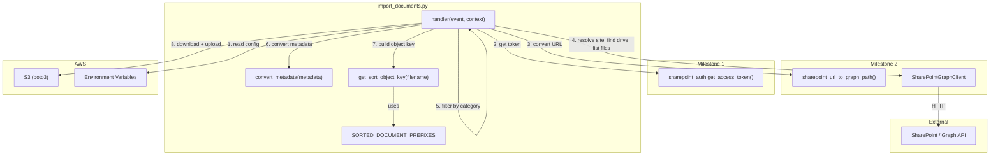
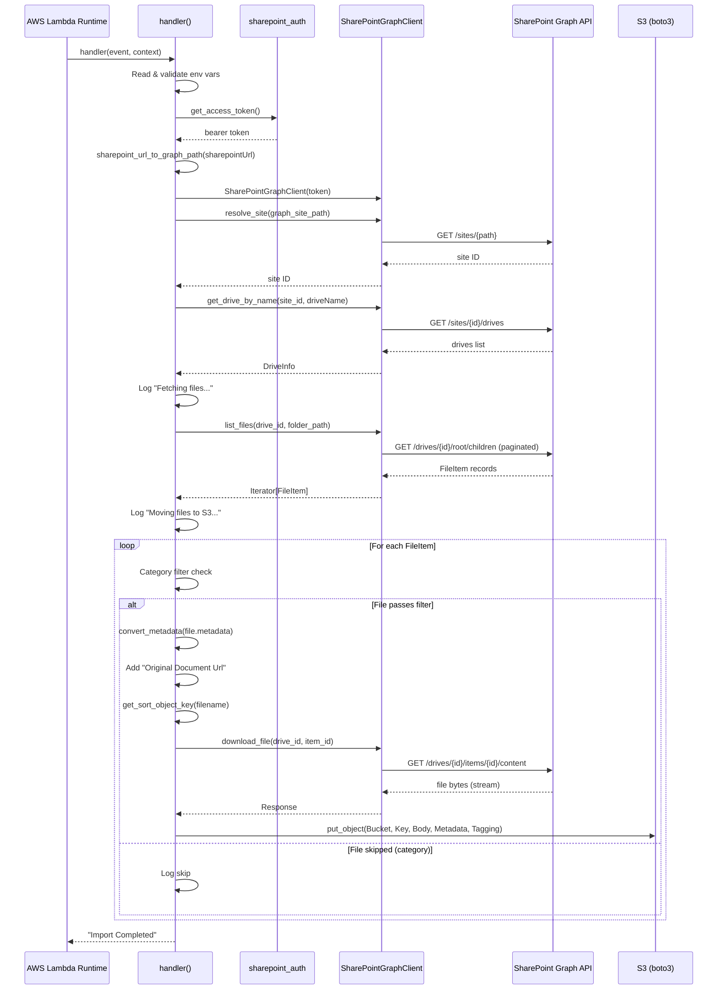

# Design Document: ImportDocuments Lambda Handler

## Overview

This module (`import_documents.py`) is the Python Lambda handler that orchestrates importing documents from a SharePoint document library into an S3 bucket. It is Milestone 3 of the ImportDocuments C#-to-Python conversion, replacing `CS Lambdas/ImportDocuments/ImportDocuments/ImportDocuments.cs` and its helper classes `MetadataHelper.cs` and `ObjectKeyHelper.cs`.

The handler reads configuration from environment variables, authenticates with SharePoint via the `sharepoint_auth` module (Milestone 1), uses the `sharepoint_graph` module (Milestone 2) to enumerate and download files, optionally filters files by category metadata, converts metadata to S3-compatible strings, generates S3 object keys with document-type prefix sorting, and uploads each file to S3 with metadata and tags.

### Key Design Decisions

1. **Single-file module**: The handler, metadata converter, and object key builder all live in `import_documents.py`. This matches the project convention established by `sharepoint_auth.py` and `sharepoint_graph.py` — each milestone is a single file.

2. **Standalone helper functions**: `convert_metadata()` and `get_sort_object_key()` are module-level functions, not methods on a class. This makes them independently testable and mirrors the C# pattern where `MetadataHelper` and `ObjectKeyHelper` are static classes.

3. **Direct boto3 usage**: The C# version uses an `IS3Storage` abstraction layer. Since Python's `boto3` is already a clean, well-documented API, we use `boto3.client('s3')` directly with `put_object()`. No wrapper needed.

4. **Stream-to-bytes pattern**: The C# code downloads to a `MemoryStream` and uploads. In Python, we call `response.content` on the streaming `requests.Response` from `download_file()` to get the bytes, then pass them as the `Body` to `put_object()`. This keeps memory usage bounded to one file at a time.

5. **URL-encoded tagging**: S3 `put_object` accepts tags as a URL-encoded query string via the `Tagging` parameter (e.g., `Project=KnowledgeAssistant`), which is simpler than a separate `put_object_tagging` call.

6. **Category filtering matches C# behavior exactly**: The C# code extracts the first 3 characters of the `Category` metadata value and checks against the category set. Files without a `Category` key are skipped when filtering is active. We replicate this logic precisely.

7. **Folder path prepended to file name for object key**: When `sharePointFolderPath` is set, the C# code uses `Path.Combine(folderPath, filePath)` before passing to `ObjectKeyHelper`. We replicate this with `posixpath.join()` to ensure forward-slash separators regardless of OS.

### Research Findings

- **boto3 `put_object` metadata**: S3 object metadata is passed as a `dict[str, str]` via the `Metadata` parameter. Keys are automatically lowercased and prefixed with `x-amz-meta-` by S3. Values must be strings. ([Source](https://boto3.amazonaws.com/v1/documentation/api/latest/reference/services/s3/client/put_object.html))
- **boto3 `put_object` tagging**: Tags are passed as a URL-encoded string via the `Tagging` parameter (e.g., `Key1=Value1&Key2=Value2`). ([Source](https://boto3.amazonaws.com/v1/documentation/api/latest/reference/services/s3/client/put_object.html))
- **C# `Path.Combine` behavior**: `Path.Combine("folder", "file.pdf")` produces `folder/file.pdf` on Linux (Lambda runtime). We use `posixpath.join()` for consistent forward-slash behavior.

## Architecture



### Execution Flow



## Components and Interfaces

### Module Constants

```python
SORTED_DOCUMENT_PREFIXES: list[str] = ["POL", "PRO", "MSM", "WI", "MAA", "SPS", "SSD", "STM"]
```

Ordered list of document type codes used for S3 key prefix assignment. Checked in order — first match wins. Matches the C# `_sortedDocuments` array exactly.

### `convert_metadata(metadata)`

```python
def convert_metadata(metadata: dict[str, object] | None) -> dict[str, str]:
    """Convert SharePoint file metadata to S3-compatible string metadata.

    Args:
        metadata: Dictionary of metadata key-value pairs from SharePoint.
                  Values may be any type. May be None.

    Returns:
        A new dict[str, str] where each value is converted via str(),
        with None values becoming empty strings.
    """
```

**Logic:**
1. If `metadata` is `None`, return an empty dict
2. For each key-value pair, convert the value to `str(value)` if not `None`, else `""`
3. Return the new dict

This is a direct port of `MetadataHelper.ConvertMetadata()` from C#.

### `get_sort_object_key(filename)`

```python
def get_sort_object_key(filename: str) -> str:
    """Generate an S3 object key with document-type prefix sorting.

    Args:
        filename: The file name (e.g., "POL-001 Policy Document.pdf").

    Returns:
        S3 object key like "{prefix}/{filename}" where prefix is the
        first matching document type code, or "Unknown" if no match.
    """
```

**Logic:**
1. Iterate through `SORTED_DOCUMENT_PREFIXES` in order
2. If `filename.startswith(prefix)`, return `f"{prefix}/{filename}"`
3. If no prefix matches, return `f"Unknown/{filename}"`

This is a direct port of `ObjectKeyHelper.GetSortObjectKey()` from C#, simplified to return just the key string (no bucket — boto3 takes bucket as a separate parameter).

### `handler(event, context)`

```python
def handler(event, context) -> str:
    """AWS Lambda handler for importing SharePoint documents to S3.

    Args:
        event: Lambda event (unused — handler is triggered on schedule or manually).
        context: Lambda context object.

    Returns:
        "Import Completed" on success.

    Raises:
        ValueError: If a required environment variable is missing or empty.
        AuthenticationError: If SharePoint authentication fails.
        SiteNotFoundError: If the SharePoint site cannot be resolved.
        DriveNotFoundError: If the target drive is not found.
        ClientError: If an S3 upload fails.
    """
```

**Logic:**
1. Read all 8 environment variables
2. Validate 6 required variables (raise `ValueError` if missing/empty)
3. Parse `csvCategories` into a `set[str]` (split on comma, trim, discard empties)
4. Resolve `sharePointFolderPath` (default to `""`)
5. Call `sharepoint_auth.get_access_token()`
6. Convert `sharepointUrl` via `sharepoint_url_to_graph_path()`
7. Create `SharePointGraphClient(token)`
8. `resolve_site()` → site ID
9. `get_drive_by_name()` → drive
10. Log "Fetching files from SharePoint..."
11. `list_files(drive_id, folder_path)` → iterator
12. Log "Moving files to S3 bucket {outputBucket}"
13. For each file:
    - Apply category filter (skip if filtered out, log skip)
    - Build file path: `posixpath.join(folder_path, file.name)` if folder_path, else `file.name`
    - Convert metadata + add `Original Document Url`
    - Generate object key via `get_sort_object_key(file_path)`
    - Download file content from SharePoint
    - Upload to S3 with metadata and tags
    - On `GraphFileNotFoundError`: log and continue
14. Return `"Import Completed"`

## Data Models

### Environment Variables

| Variable | Required | Default | Description |
|---|---|---|---|
| `clientId` | Yes | — | Azure AD application client identifier |
| `clientSecret` | Yes | — | Azure AD application client secret |
| `tenantId` | Yes | — | Azure AD tenant identifier |
| `sharepointUrl` | Yes | — | SharePoint site URL |
| `driveName` | Yes | — | Target document library name |
| `outputBucket` | Yes | — | S3 destination bucket name |
| `csvCategories` | No | `""` | Comma-separated 3-char category prefixes |
| `sharePointFolderPath` | No | `""` | Folder path within the drive |

### S3 Object Structure

Each uploaded object has:
- **Key**: `{document_type_prefix}/{filename}` (e.g., `POL/POL-001 Policy.pdf` or `Unknown/misc.docx`)
- **Body**: Raw file bytes from SharePoint
- **Metadata**: Converted SharePoint metadata (`dict[str, str]`) plus `Original Document Url`
- **Tags**: `Project=KnowledgeAssistant`

### Reused Data Models (from Milestone 2)

- `FileItem(name, item_id, drive_id, web_url, metadata)` — from `sharepoint_graph.py`
- `DriveInfo(drive_id, drive_name)` — from `sharepoint_graph.py`


## Correctness Properties

*A property is a characteristic or behavior that should hold true across all valid executions of a system — essentially, a formal statement about what the system should do. Properties serve as the bridge between human-readable specifications and machine-verifiable correctness guarantees.*

### Property 1: CSV category parsing produces the correct set

*For any* comma-separated string, parsing it into a category set SHALL produce a set containing exactly the non-empty, whitespace-trimmed substrings between commas. Empty entries (from consecutive commas, leading/trailing commas) SHALL be discarded, and whitespace-only entries SHALL be discarded.

**Validates: Requirements 3.1, 3.2, 3.3**

### Property 2: Category filter correctness

*For any* file with metadata and *any* non-empty category set, the file SHALL pass the category filter if and only if: (a) the file's metadata contains a `Category` key, AND (b) the first 3 characters of the `Category` value are present in the category set. Files without a `Category` key SHALL be skipped when the category set is non-empty.

**Validates: Requirements 5.2, 5.3, 5.5**

### Property 3: Metadata conversion type invariant

*For any* `dict[str, object]` input (including dicts with `None` values, numeric values, boolean values, and nested objects), `convert_metadata()` SHALL return a `dict[str, str]` where every value is of type `str`, every key is preserved, and `None` input values become empty strings `""`.

**Validates: Requirements 6.1, 6.2, 6.4**

### Property 4: Object key structural invariant

*For any* non-empty file name string, `get_sort_object_key()` SHALL return a string containing exactly one `/` separator, with a non-empty prefix before the `/` and the original file name after the `/`.

**Validates: Requirements 7.1, 7.5**

### Property 5: Object key prefix assignment

*For any* file name, if the file name starts with one of the `SORTED_DOCUMENT_PREFIXES`, then `get_sort_object_key()` SHALL return a key whose prefix (before the `/`) equals the first matching prefix from the list. If the file name does not start with any prefix, the prefix SHALL be `"Unknown"`.

**Validates: Requirements 7.2, 7.3, 7.4**

## Error Handling

### Error Categories

| Error Type | Source | Handling |
|---|---|---|
| Missing required env var | `handler()` validation | Raises `ValueError` with message containing the variable name |
| `AuthenticationError` | `sharepoint_auth.get_access_token()` | Propagated as-is to Lambda runtime |
| `ValueError` (URL) | `sharepoint_url_to_graph_path()` | Propagated as-is to Lambda runtime |
| `SiteNotFoundError` | `SharePointGraphClient.resolve_site()` | Propagated as-is to Lambda runtime |
| `DriveNotFoundError` | `SharePointGraphClient.get_drive_by_name()` | Propagated as-is to Lambda runtime |
| `GraphFileNotFoundError` | `SharePointGraphClient.download_file()` | Logged and skipped — processing continues with remaining files |
| `SharePointGraphError` | Any Graph API call | Propagated as-is to Lambda runtime |
| `ClientError` (S3) | `boto3 s3.put_object()` | Propagated as-is to Lambda runtime |

### Error Flow

1. **Environment variable validation** happens first, before any external calls. All 6 required variables are checked; the first missing one triggers a `ValueError`.
2. **SharePoint errors** (auth, site resolution, drive lookup) propagate immediately — these are fatal to the entire import.
3. **Per-file download errors** (`GraphFileNotFoundError`) are caught, logged with the file name and error details, and processing continues with the next file. This matches the resilient behavior expected for batch processing.
4. **S3 upload errors** propagate immediately — if we can't write to S3, continuing is pointless.
5. **All other exceptions** propagate to the Lambda runtime, which handles logging and retry behavior.

### Design Decision: GraphFileNotFoundError is Non-Fatal

The C# code doesn't explicitly handle per-file download errors, but the Python version adds this resilience per Requirement 10.5. If a single file has been deleted from SharePoint between listing and downloading, the import should continue with the remaining files rather than aborting the entire batch.

## Testing Strategy

### Property-Based Tests (Hypothesis)

The module uses [Hypothesis](https://hypothesis.readthedocs.io/) for property-based testing. Each property test runs a minimum of 100 iterations.

| Property | Test Description | Tag |
|---|---|---|
| Property 1 | Generate random CSV strings with varying whitespace, commas, empty entries. Verify parsed set matches expected trimmed non-empty entries. | `Feature: import-documents-lambda, Property 1: CSV category parsing produces the correct set` |
| Property 2 | Generate random FileItem metadata dicts and category sets. Verify filter pass/fail matches the 3-char prefix membership rule. | `Feature: import-documents-lambda, Property 2: Category filter correctness` |
| Property 3 | Generate random `dict[str, object]` with None, int, bool, str, float values. Verify all output values are `str` and None→`""`. | `Feature: import-documents-lambda, Property 3: Metadata conversion type invariant` |
| Property 4 | Generate random non-empty file name strings. Verify output has exactly one `/` with non-empty prefix and original filename. | `Feature: import-documents-lambda, Property 4: Object key structural invariant` |
| Property 5 | Generate file names starting with each prefix and file names not starting with any prefix. Verify correct prefix assignment. | `Feature: import-documents-lambda, Property 5: Object key prefix assignment` |

### Unit Tests (pytest)

Example-based tests for specific behavioral requirements not covered by properties:

**Environment variable validation (Req 2.1–2.8):**
- Test each of the 6 required variables missing/empty → `ValueError` with correct name
- Test optional variables missing → defaults applied

**Handler orchestration (Req 4, 8, 9):**
- Mock all external dependencies, run handler end-to-end, verify:
  - `get_access_token()` called once
  - `sharepoint_url_to_graph_path()` called with correct URL
  - `SharePointGraphClient` created with token
  - `resolve_site()`, `get_drive_by_name()`, `list_files()` called in order
  - `put_object()` called for each file with correct Key, Body, Metadata, Tagging
  - Return value is `"Import Completed"`

**Folder path handling (Req 8.5):**
- Test with folder path set → file path is `folder/filename`
- Test without folder path → file path is just `filename`

**Error propagation (Req 10.1–10.6):**
- Mock each dependency to raise its specific error, verify propagation
- Mock `download_file()` to raise `GraphFileNotFoundError` for one file, verify other files still processed

**Logging (Req 11.1–11.5):**
- Capture log output, verify key messages present at correct log levels

**Module interface (Req 9.1, 12.2, 12.3):**
- Verify `handler` function exists with `(event, context)` signature
- Verify `convert_metadata` and `get_sort_object_key` are importable and callable independently

### Test Dependencies

- `pytest` — test runner
- `hypothesis` — property-based testing
- `unittest.mock` — mocking boto3, sharepoint_auth, sharepoint_graph
- `moto` (optional) — if full S3 integration tests are desired

### Test File Structure

```
tests/
  test_import_documents.py    # Unit tests + property tests in one file
```

All tests mock external dependencies (boto3 S3, sharepoint_auth, sharepoint_graph) — no real AWS or SharePoint calls are made during testing.
