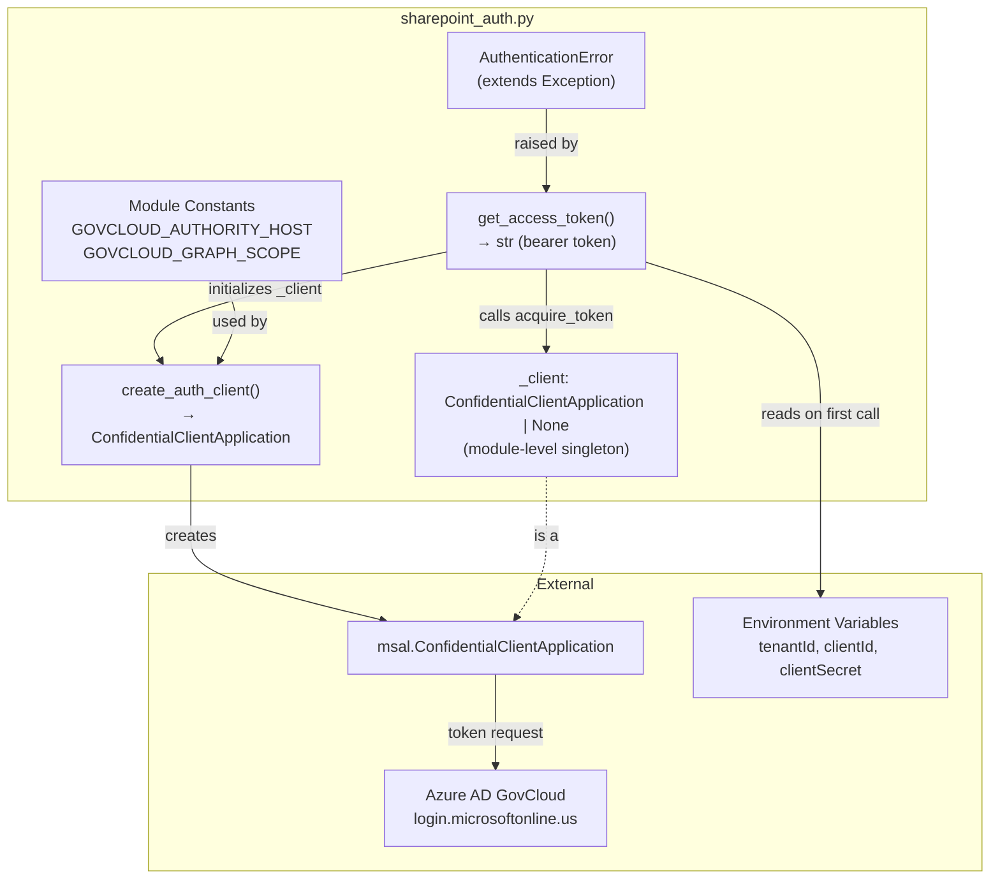
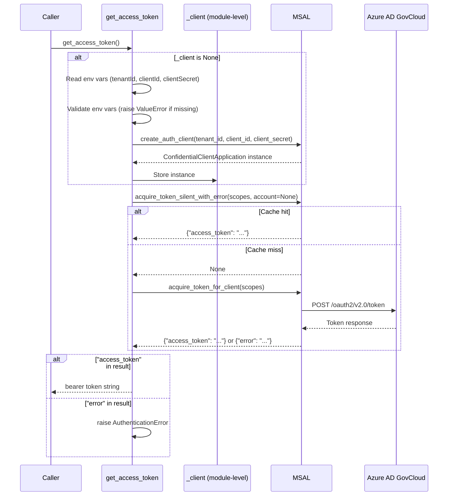

# Design Document

## Overview

This design covers the `sharepoint_auth.py` module — a single-file Python module that acquires OAuth2 access tokens from Azure AD GovCloud using the MSAL (Microsoft Authentication Library) client credentials flow. It replaces the authentication behavior previously handled by the internal `AI_Libraries.SharePoint` NuGet package in the C# ImportDocuments Lambda.

The module provides two entry points:
- `create_auth_client(tenant_id, client_id, client_secret)` — factory function returning a configured MSAL `ConfidentialClientApplication`
- `get_access_token()` — convenience function that auto-initializes from environment variables and returns a bearer token string

All endpoints are hardcoded to Azure AD GovCloud (`login.microsoftonline.us`) and Microsoft Graph GovCloud (`graph.microsoft.us`). The module raises a custom `AuthenticationError` for any token acquisition failure.

### Key Design Decisions

1. **Single file module**: All auth logic lives in `sharepoint_auth.py` — no package structure needed for this scope.
2. **MSAL's built-in cache**: Since MSAL Python 1.23, `acquire_token_for_client()` automatically checks the in-memory token cache before making a network call. We rely on this rather than manually calling `acquire_token_silent_with_error` first. The requirements specify using `acquire_token_silent_with_error` as the first attempt, so we implement the two-step pattern for explicit cache-first behavior and compatibility with older MSAL versions.
3. **Module-level singleton**: The `get_access_token()` function uses a module-level `_client` variable to reuse the MSAL client across calls within a single Lambda invocation, avoiding repeated initialization.
4. **GovCloud-only**: Authority and scope constants are hardcoded — no commercial endpoint support. This is a security requirement.
5. **No `requests` dependency**: MSAL bundles its own HTTP transport internally, so the module depends only on `msal`.

### Research Findings

- **MSAL Python error handling**: MSAL returns errors as dict values (with `error` and `error_description` keys) rather than raising exceptions. Network-level errors (e.g., DNS failures, timeouts) propagate as standard Python exceptions from the underlying HTTP transport. ([Source](https://learn.microsoft.com/en-us/entra/msal/python/advanced/msal-error-handling-python))
- **`acquire_token_for_client` caching**: Since MSAL Python 1.23, this method automatically checks the token cache before hitting the network. For explicit cache-first behavior matching the requirements, we still use the `acquire_token_silent_with_error` → `acquire_token_for_client` two-step pattern. ([Source](https://learn.microsoft.com/en-us/python/api/msal/msal.application.confidentialclientapplication))
- **GovCloud authority**: The C# code uses `AzureHostUrls.GovCloud` which maps to `login.microsoftonline.us`. The Python module hardcodes this directly.
- **Client credentials flow**: For daemon/service apps (like a Lambda), the client credentials flow uses `acquire_token_for_client(scopes=[...])` with no user interaction. The scope for Graph API is always `https://graph.microsoft.us/.default` in GovCloud.

## Architecture



### Flow: `get_access_token()`



## Components and Interfaces

### Module Constants

```python
GOVCLOUD_AUTHORITY_HOST: str = "login.microsoftonline.us"
GOVCLOUD_GRAPH_SCOPE: list[str] = ["https://graph.microsoft.us/.default"]
```

These are module-level constants. No configuration mechanism overrides them — GovCloud endpoints are the only supported target.

### `AuthenticationError` Exception

```python
class AuthenticationError(Exception):
    """Raised when Azure AD token acquisition fails."""

    def __init__(self, error: str, error_description: str = ""):
        self.error = error
        self.error_description = error_description
        super().__init__(f"{error}: {error_description}")
```

Extends `Exception`. Stores the MSAL `error` and `error_description` fields as attributes for programmatic access.

### `create_auth_client(tenant_id, client_id, client_secret)`

```python
def create_auth_client(
    tenant_id: str,
    client_id: str,
    client_secret: str,
) -> msal.ConfidentialClientApplication:
```

Factory function that:
1. Constructs the authority URL: `https://{GOVCLOUD_AUTHORITY_HOST}/{tenant_id}`
2. Creates and returns a `msal.ConfidentialClientApplication` with the given credentials and authority

Does not perform any network calls — MSAL defers token acquisition until explicitly requested.

### `get_access_token()`

```python
def get_access_token() -> str:
```

Convenience function that:
1. On first call: reads `tenantId`, `clientId`, `clientSecret` from environment variables, validates they are present (raises `ValueError` if not), and initializes the module-level `_client` via `create_auth_client()`
2. Attempts `acquire_token_silent_with_error(GOVCLOUD_GRAPH_SCOPE, account=None)` for cache-first behavior
3. On cache miss (returns `None`): calls `acquire_token_for_client(GOVCLOUD_GRAPH_SCOPE)`
4. If the result contains `access_token`: returns it
5. If the result contains `error`: raises `AuthenticationError` with the error details

### Module-Level State

```python
_client: msal.ConfidentialClientApplication | None = None
```

Singleton pattern — initialized on first `get_access_token()` call, reused for the lifetime of the Lambda execution environment (warm starts reuse the same module-level state).

## Data Models

### MSAL Token Response (Success)

```python
{
    "access_token": str,       # The bearer token
    "token_type": "Bearer",
    "expires_in": int,         # Seconds until expiry (typically 3600)
}
```

### MSAL Token Response (Error)

```python
{
    "error": str,              # Machine-readable error code (e.g., "invalid_client")
    "error_description": str,  # Human-readable description
    "error_codes": list[int],  # Azure AD error codes
    "timestamp": str,
    "trace_id": str,
    "correlation_id": str,
}
```

### Environment Variables

| Variable | Required | Description |
|---|---|---|
| `tenantId` | Yes | Azure AD GovCloud tenant identifier |
| `clientId` | Yes | Azure AD application (client) identifier |
| `clientSecret` | Yes | Azure AD application client secret |

### `AuthenticationError` Attributes

| Attribute | Type | Description |
|---|---|---|
| `error` | `str` | Machine-readable error code from Azure AD |
| `error_description` | `str` | Human-readable error description |


## Correctness Properties

*A property is a characteristic or behavior that should hold true across all valid executions of a system — essentially, a formal statement about what the system should do. Properties serve as the bridge between human-readable specifications and machine-verifiable correctness guarantees.*

### Property 1: Auth client configuration preserves credentials and uses GovCloud authority

*For any* valid (tenant_id, client_id, client_secret) tuple, calling `create_auth_client(tenant_id, client_id, client_secret)` SHALL produce a `ConfidentialClientApplication` whose authority URL equals `https://login.microsoftonline.us/{tenant_id}` and whose client_id and client_credential match the provided values.

**Validates: Requirements 1.1, 1.2**

### Property 2: Successful token extraction

*For any* MSAL response dict containing an `access_token` key with a non-empty string value, `get_access_token()` SHALL return that exact string unchanged.

**Validates: Requirements 2.3**

### Property 3: Error response raises AuthenticationError with matching fields

*For any* MSAL response dict containing an `error` key and an `error_description` key, `get_access_token()` SHALL raise an `AuthenticationError` whose `error` attribute equals the response's `error` value and whose `error_description` attribute equals the response's `error_description` value.

**Validates: Requirements 5.1, 5.3, 5.4**

### Property 4: GovCloud-only endpoint enforcement

*For any* tenant_id string, the authority URL constructed by `create_auth_client` SHALL NOT contain the substring `login.microsoftonline.com` or `graph.microsoft.com`, and the module-level `GOVCLOUD_GRAPH_SCOPE` SHALL NOT contain any scope string with the substring `graph.microsoft.com`.

**Validates: Requirements 1.3, 2.4, 7.1, 7.2, 7.3**

### Property 5: Missing environment variable validation

*For any* of the three required environment variables (`tenantId`, `clientId`, `clientSecret`), if that variable is missing or set to an empty string, calling `get_access_token()` SHALL raise a `ValueError` whose message contains the name of the missing variable.

**Validates: Requirements 4.4, 4.5, 4.6**

## Error Handling

### Error Categories

| Error Type | Source | Handling |
|---|---|---|
| Missing env var | `get_access_token()` | Raises `ValueError` with message `Missing required environment variable: {name}` |
| MSAL error response | Azure AD via MSAL | Raises `AuthenticationError` with `error` and `error_description` from the response dict |
| Network failure | MSAL HTTP transport | Propagated as-is (e.g., `ConnectionError`, `TimeoutError`) — no wrapping or suppression |
| Invalid MSAL args | MSAL constructor | Propagated as-is (MSAL raises `ValueError` for malformed parameters) |

### Error Flow

1. **Environment variable validation** happens first, before any MSAL interaction. All three variables are checked; the first missing one triggers a `ValueError`.
2. **Token acquisition errors** are detected by checking for the `error` key in the MSAL response dict. Both `acquire_token_silent_with_error` and `acquire_token_for_client` can return error dicts.
3. **Network errors** are not caught — they propagate with their full traceback, per Requirement 5.2.

### `AuthenticationError` Usage

```python
# Example: how the error is raised internally
result = client.acquire_token_for_client(scopes=GOVCLOUD_GRAPH_SCOPE)
if "error" in result:
    raise AuthenticationError(
        error=result["error"],
        error_description=result.get("error_description", ""),
    )
```

Callers (e.g., the Lambda handler in Milestone 4) can catch `AuthenticationError` specifically and log the `error` / `error_description` attributes for troubleshooting.

## Testing Strategy

### Property-Based Tests (Hypothesis)

The module uses [Hypothesis](https://hypothesis.readthedocs.io/) for property-based testing. Each property test runs a minimum of 100 iterations.

| Property | Test Description | Tag |
|---|---|---|
| Property 1 | Generate random credential tuples, mock `ConfidentialClientApplication`, verify authority URL format and credential passthrough | `Feature: sharepoint-auth-module, Property 1: Auth client configuration preserves credentials and uses GovCloud authority` |
| Property 2 | Generate random access_token strings, mock MSAL to return success responses, verify `get_access_token()` returns the exact token | `Feature: sharepoint-auth-module, Property 2: Successful token extraction` |
| Property 3 | Generate random error/error_description pairs, mock MSAL to return error responses, verify `AuthenticationError` attributes match | `Feature: sharepoint-auth-module, Property 3: Error response raises AuthenticationError with matching fields` |
| Property 4 | Generate random tenant_id strings (including adversarial ones containing "login.microsoftonline.com"), verify no commercial domains in constructed URLs | `Feature: sharepoint-auth-module, Property 4: GovCloud-only endpoint enforcement` |
| Property 5 | For each of the three env vars, generate random empty/missing states, verify `ValueError` is raised with the correct variable name | `Feature: sharepoint-auth-module, Property 5: Missing environment variable validation` |

### Unit Tests (pytest)

Example-based tests for specific behavioral requirements not covered by properties:

- **Cache-first behavior** (Req 2.1): Mock MSAL, verify `acquire_token_silent_with_error` is called before `acquire_token_for_client`
- **Cache hit skips network** (Req 3.2): Mock `acquire_token_silent_with_error` to return a valid token, verify `acquire_token_for_client` is NOT called
- **Client reuse / singleton** (Req 3.1): Call `get_access_token()` twice, verify `_client` is the same object
- **Auto-initialization from env vars** (Req 6.3): Reset `_client`, set env vars, call `get_access_token()`, verify client was initialized
- **Network error propagation** (Req 5.2): Mock MSAL to raise `ConnectionError`, verify it propagates unchanged
- **Module interface smoke tests** (Req 6.1, 6.2, 6.4): Verify `get_access_token`, `create_auth_client`, and `AuthenticationError` exist with correct signatures
- **GovCloud constants** (Req 7.1, 7.2, 7.4): Assert `GOVCLOUD_AUTHORITY_HOST` and `GOVCLOUD_GRAPH_SCOPE` have correct values

### Test Dependencies

- `pytest` — test runner
- `hypothesis` — property-based testing
- `unittest.mock` — mocking MSAL and environment variables (stdlib, no extra dependency)

### Test File Structure

```
tests/
  test_sharepoint_auth.py          # Unit tests + property tests in one file
```

All tests mock the MSAL library — no real Azure AD calls are made during testing.
