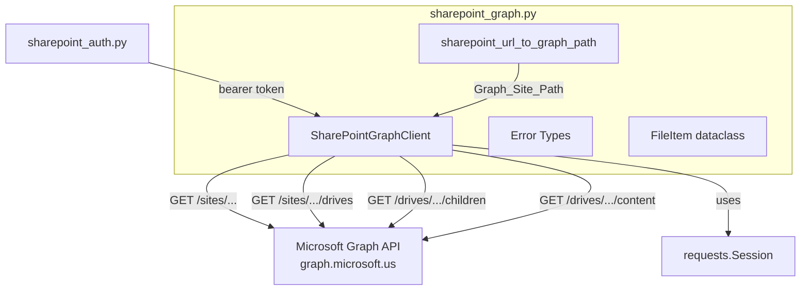
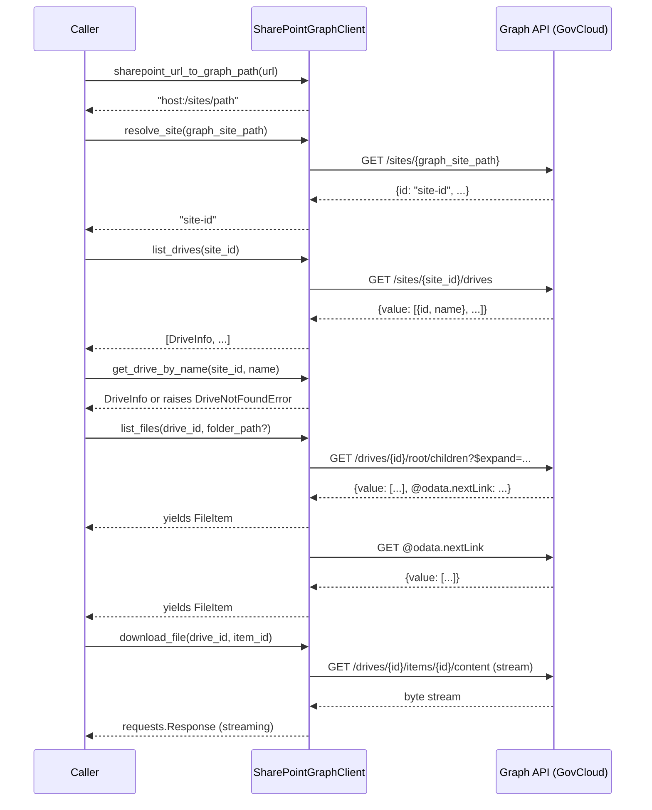

# Design Document: SharePoint Graph API Client

## Overview

This module (`sharepoint_graph.py`) provides a Python wrapper around the Microsoft Graph API endpoints needed to list and download files from a SharePoint document library in Azure GovCloud. It is Milestone 2 of the ImportDocuments C#-to-Python conversion.

The module exposes a single `SharePointGraphClient` class that accepts a bearer token (from the `sharepoint_auth` module, Milestone 1) and orchestrates four operations:

1. Convert a user-facing SharePoint URL to the Graph API site-addressing format
2. Resolve a SharePoint site to obtain its Site ID
3. List drives for a site and find a specific drive by name
4. List files in a drive (with pagination and optional folder filtering) and download file content as a stream

All HTTP traffic targets the GovCloud Graph endpoint (`https://graph.microsoft.us/v1.0`) by default. The module uses `requests.Session` for connection reuse and supports context-manager usage for clean session teardown.

### Design Rationale

- **Single-file module**: Matches the project convention established by `sharepoint_auth.py`. No package structure needed — the module is small enough to remain a single file.
- **Class-based client**: Groups the bearer token, base URL, and HTTP session into one object, avoiding repeated parameter passing. The C# version uses a similar `ISharePointClient` pattern.
- **Pure URL converter function**: `sharepoint_url_to_graph_path()` is a module-level pure function (no HTTP, no state) because it's useful independently and easy to property-test.
- **Generator-based file listing**: `list_files()` yields `FileItem` records lazily, handling pagination internally. This keeps memory usage constant regardless of how many files exist in the library.
- **Streaming downloads**: `download_file()` returns the raw `requests.Response` with `stream=True`, letting callers read content incrementally without buffering the entire file.

## Architecture



### Request Flow



## Components and Interfaces

### Module-Level Pure Function

```python
def sharepoint_url_to_graph_path(sharepoint_url: str) -> str:
    """Convert a SharePoint URL to Graph API site-addressing format.

    Args:
        sharepoint_url: URL like "https://{host}/sites/{path}"

    Returns:
        Graph site path like "{host}:/sites/{path}"

    Raises:
        ValueError: If URL is empty, None, or missing /sites/ segment.
    """
```

**Logic:**
1. Validate input is non-empty
2. Strip trailing slash
3. Parse URL to extract host and path
4. Verify `/sites/` is present in the path
5. Return `{host}:/sites/{remainder}`

### SharePointGraphClient Class

```python
class SharePointGraphClient:
    """Microsoft Graph API client for SharePoint operations.

    Args:
        token: Bearer token string from sharepoint_auth module.
        base_url: Graph API base URL. Defaults to GRAPH_BASE_URL.
    """

    GRAPH_BASE_URL: str = "https://graph.microsoft.us/v1.0"

    def __init__(self, token: str, base_url: str | None = None) -> None: ...
    def __enter__(self) -> "SharePointGraphClient": ...
    def __exit__(self, *exc) -> None: ...

    def resolve_site(self, graph_site_path: str) -> str:
        """Resolve a Graph site path to a Site ID.

        Returns:
            The site ID string.

        Raises:
            SiteNotFoundError: If the site does not exist (HTTP 404).
            SharePointGraphError: For other HTTP errors.
        """

    def list_drives(self, site_id: str) -> list[DriveInfo]:
        """List all drives for a site.

        Returns:
            List of DriveInfo records.

        Raises:
            SharePointGraphError: For HTTP errors.
        """

    def get_drive_by_name(self, site_id: str, drive_name: str) -> DriveInfo:
        """Find a drive by name within a site.

        Returns:
            The matching DriveInfo record.

        Raises:
            DriveNotFoundError: If no drive matches the name.
            SharePointGraphError: For HTTP errors.
        """

    def list_files(
        self, drive_id: str, folder_path: str = ""
    ) -> Iterator[FileItem]:
        """List files in a drive, optionally filtered to a folder.

        Yields:
            FileItem records for each file (skips folders).
            Handles pagination automatically.

        Raises:
            SharePointGraphError: For HTTP errors.
        """

    def download_file(self, drive_id: str, item_id: str) -> requests.Response:
        """Download file content as a streaming response.

        Returns:
            A requests.Response with stream=True. Caller must close it.

        Raises:
            GraphFileNotFoundError: If the file does not exist (HTTP 404).
            SharePointGraphError: For other HTTP errors.
        """
```

### Internal Helper

```python
def _raise_for_graph_error(self, response: requests.Response) -> None:
    """Check response status and raise appropriate error.

    Extracts error.message from JSON body when available.
    Maps HTTP 404 to the appropriate NotFound subclass based on context.
    """
```

### Error Types

```python
class SharePointGraphError(Exception):
    """Base exception for Graph API errors."""
    def __init__(self, status_code: int, message: str): ...

class SiteNotFoundError(SharePointGraphError):
    """Raised when site resolution returns HTTP 404."""

class DriveNotFoundError(Exception):
    """Raised when a drive name is not found in the drives list."""
    def __init__(self, drive_name: str): ...

class GraphFileNotFoundError(SharePointGraphError):
    """Raised when file download returns HTTP 404."""
```

**Design decision — `DriveNotFoundError`**: This does NOT extend `SharePointGraphError` because it's not an HTTP error. It's a logical error raised after a successful API call returns a list that doesn't contain the requested drive. This matches the C# pattern where `FirstOrDefault` returns null and the caller checks for it.

**Design decision — `GraphFileNotFoundError` naming**: Uses `Graph` prefix to avoid shadowing Python's built-in `FileNotFoundError`, as called out in the requirements.

## Data Models

```python
@dataclass(frozen=True)
class DriveInfo:
    """Represents a SharePoint document library (drive)."""
    drive_id: str
    drive_name: str
```

```python
@dataclass(frozen=True)
class FileItem:
    """Represents a file from a SharePoint drive listing."""
    name: str
    item_id: str
    drive_id: str
    web_url: str
    metadata: dict[str, object]
```

**`FileItem.metadata`**: Extracted from `listItem.fields` in the Graph API response. The C# version stores this as `IReadOnlyDictionary<string, object>` — we use a plain `dict` since Python doesn't have a frozen-dict built-in. The metadata dict is passed through as-is to the S3 upload module (Milestone 3) which converts values to strings.

**`DriveInfo`**: Minimal record — only the fields needed by downstream code. The Graph API returns many more fields per drive, but we only need `id` and `name`.

Both dataclasses are frozen (immutable) to prevent accidental mutation and to make them safe for use in sets/dicts if needed.

